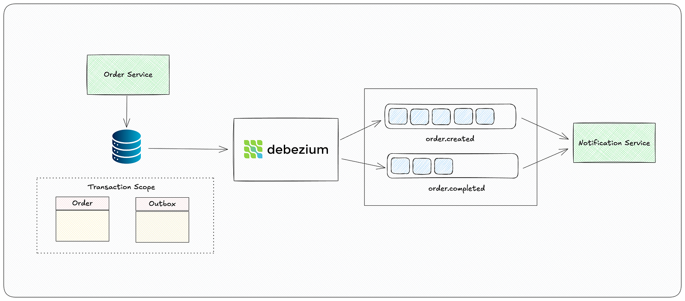

# outbox-debezium-connector

## High-level Architecture


## Tech Stack

```
- Docker
- Postgresql
- Zookeeper
- Kafka
- Debezium
```

## Setup & Run
```sh
# Run all instances
docker-compose up
```

The endpoints for kafka and debezium:

```sh
Kafka UI: http://localhost:8081
Debezium UI: http://localhost:8082
Debezium API: http://localhost:8083
```

Step 1: Create a table on postgresql.

```shell
# Execute create_table.sql file
```

Step 2: Create a publication on postgresql for debezium.

```shell
# Execute create_publication.sql file
```

Step 3: Create the debezium connector.

```shell
# Send a request to "http://localhost:8083/connectors" with the payload in the create_connector.json file. 
```

Step 4: Trigger the debezium connector with data changes.

```shell
# Execute insert_order_outbox.sql file
```
